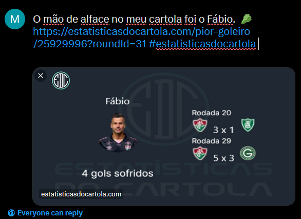

<p align="center">
  
</p>

O intuito do projeto é utilizar os dados disponíveis nas APIs abertas do cartola e fazer análises em cima das escalações na temporada.
Foi implementado um sistema de conquistas em cima das pontuações das rodadas e acontecimentos na temporada, como, por exemplo, 3 jogadores expulsos na temporada:

<p align="center">
  
</p>

O site tá hospedado no domínio: [estatisticasdocartola.com](https://estatisticasdocartola.com)

### Compartilhe no Twitter/X
O compartilhamento das estatísticas no Twitter/X gera imagens personalizadas de acordo com a estatística/medalha específica que você queira compartilhar. Para cada caso, é gerada uma imagem e um link específico para que o tweet fique com essa disposição:

<p align="center">
  
</p>


### Tecnologias utilizadas
- Typescript
- Next.js 13
- Vercel
- TailwindCSS
- Mantine Design System
- html2canvas

## Quer contribuir no projeto?
Abra uma [Issue](https://github.com/mtsdalmolin/cartola-statistics/issues/new) ou faça um [Fork](https://github.com/mtsdalmolin/cartola-statistics/fork) do projeto e submeta um PR com as alterações para eu avaliar.

## Como rodar o projeto
Para levantar o ambiente de desenvolvimento:

```bash
npm run dev
# or
yarn dev
# or
pnpm dev
```

O ambiente vai estar disponível em [http://localhost:3000](http://localhost:3000).
